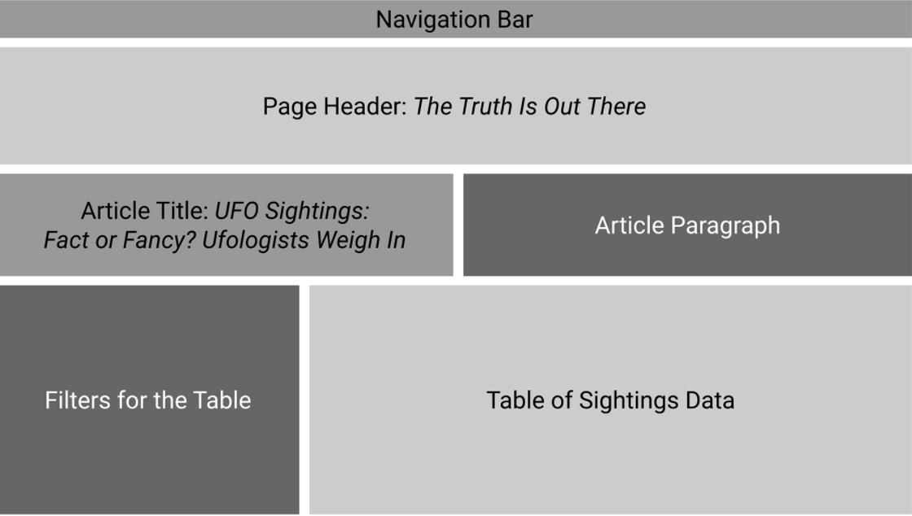
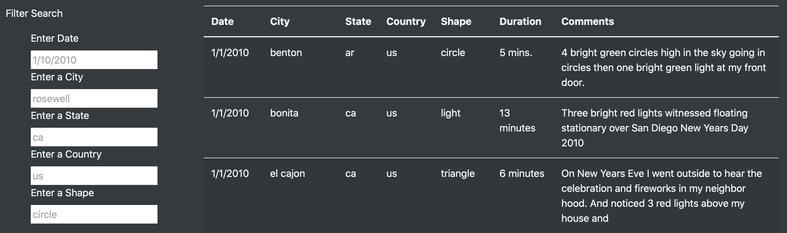
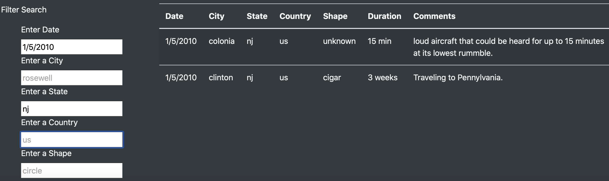

# UFOs

## Overview
Dana would like to have a more in depth-analysis of UFO sightings, so we would help her to create filtering multiple criteria on the webpage we generated. In this project, we will create the webpage by using JavaScript and HTML that allows users to filter for multiple criteria at the same time. As result, users will be able to search on the webpage by date, city, state, country, and shape.

## Results
Once the user click on the index.html, the structured webpage will load as Figure 1.
  
  Figure 1: Webpage Layout
  The user would see the navigation Bar, Page Header, Article Title, Article Paragraph, Filters for the Table, and Table of Sighting Data. The user could scrolls down to the Filters for the Table and search for the criteria that he/she would like to see. The filters include: date, city, state, country and shape. 
  
  Figure 2: Filter Search
  For example, the user would like to see the data on 1/5/2010 and NJ state, the user could simply type into these two filters and press enter, then the result will shown as the same in Figure 3.
  
  Figure 1: Result of 1/5/2010 in NJ
  Another than pressing enter, the user could also click on the next filter that he/she would like to to see, the result would also load. For example, the user enters 1/5/2010 then click on the blank box under “Enter a State,” all the results of UFO sightings on 1/5/2010 would show. 

## Summary
